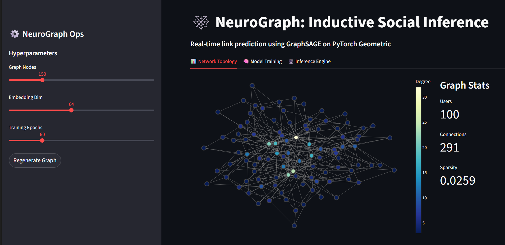

# 🧠 NeuroGraph: Inductive Social Link Prediction

[](https://www.python.org/)
[](https://pytorch-geometric.readthedocs.io/)
[](https://streamlit.io/)
[](LICENSE)

**NeuroGraph** is a production-grade machine learning system designed to predict social connections in dynamic networks.

Unlike traditional Transductive models (like standard GCNs) that require retraining whenever a new user joins, NeuroGraph utilizes **GraphSAGE** (Sample and Aggregate) to perform **Inductive Learning**. This allows the system to generate embeddings and accurate recommendations for brand-new users immediately (solving the **"Cold Start"** problem), making it suitable for high-velocity platforms like social media or e-commerce.

---

## 🚀 Key Features

* **Inductive Inference Engine:** Generates embeddings for unseen nodes by learning aggregator functions rather than fixed node lookups.
* **Real-Time Visualization:** Interactive, physics-based network rendering using **Plotly** & **NetworkX**.
* **Scalable Architecture:** Built on `Torch Geometric` with a modular design pattern ready for mini-batch training (NeighborSampling).
* **End-to-End Pipeline:** Includes synthetic data generation (Barabasi-Albert scale-free graphs), model training, and an interactive inference frontend.

---

## 📸 Dashboard Preview


---

## 🛠️ Architecture

The system follows a microservices-ready structure separating Data, Model, and Presentation layers:

```text
neurograph/
├── app.py                 # Frontend: Streamlit Interface & State Management
├── requirements.txt       # Dependencies
└── src/                   # Core Logic Module
    ├── data_gen.py        # ETL: Generates Scale-Free Social Graphs
    ├── model.py           # ML: GraphSAGE Architecture (Enc/Dec)
    └── visualizer.py      # UX: Interactive Plotly Rendering Logic

Training Strategy
Loss Function: Binary Cross-Entropy (BCE).
Sampling: Negative Sampling (1:1 ratio of positive friends to random strangers).
Optimization: Adam Optimizer.

📦 Installation & Usage
Clone the repository

Bash

git clone [https://github.com/SohiniManne/NeuroGraph.git](https://github.com/SohiniManne/NeuroGraph.git)
cd neurograph
Install Dependencies

Bash

pip install -r requirements.txt
Run the Application

Bash

streamlit run app.py
🔮 Future Roadmap
[ ] Scale: Implement FAISS for approximate nearest neighbor search to handle 10M+ nodes.
[ ] Temporal: Add TGN (Temporal Graph Networks) to weight recent interactions higher than old ones.
[ ] Ops: Containerize with Docker and deploy via TorchServe for low-latency API access.

    ├── data_gen.py        # ETL: Generates Scale-Free Social Graphs
    ├── model.py           # ML: GraphSAGE Architecture (Enc/Dec)
    └── visualizer.py      # UX: Interactive Plotly Rendering Logic
